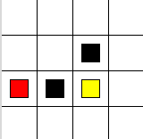
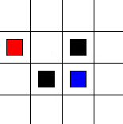
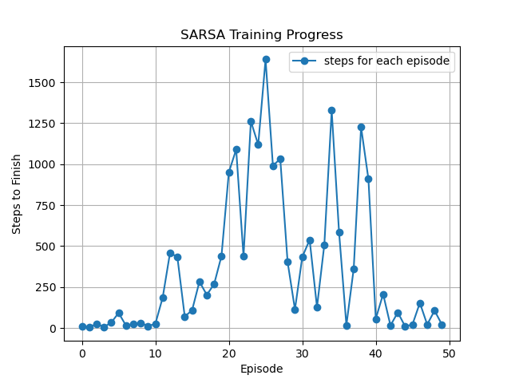
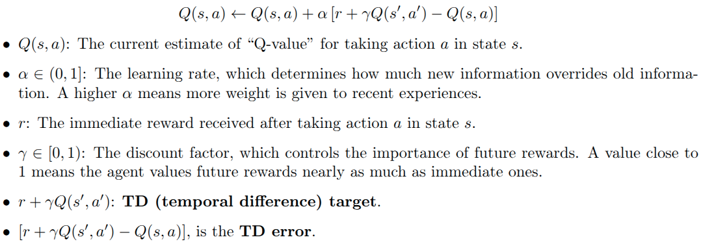
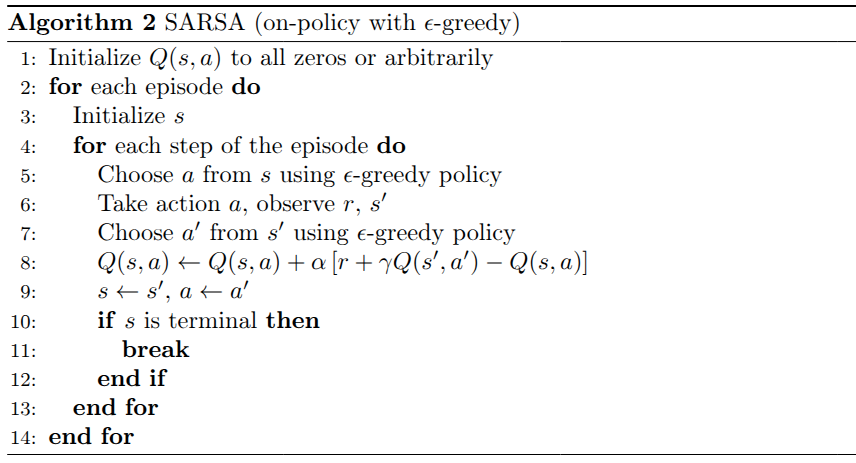

# Implement SARSA learning on a 2D grid world

This project is to use SARSA-learning to let the agent, a red square 🟥, find its target in a simple 2D maze. The black square ⬛️ is an obstacle, which will terminate the movement of the agent once it hits there. The blue square 🟦 is the target that the agent is trying to search in this 2D maze.

## Environment Setting
The environment is in a $4 \times 4$ grid world. The red square agent 🟥 moves in 4 actions: `up`, `down`, `right` and `left`. If the agent hits the black square obstacle ⬛️, a penalty `reward = -1` will be applied. If the agent hits the target square 🟦, a `reward = 1` will be applied. Otherwise, the agent get `reward = 0`. If the agent hit the boundary, it will stays at the current state. 



This project is greatly inspired by [mofanpy's reinforcement learning course](https://mofanpy.com/tutorials/machine-learning/reinforcement-learning/tabular-sarsa1).

Please turn to his course if you speak fluent Chinese for more thoughtful understanding. Or you can leave a message here on Github to discuss it with me or send me an email on jz3293@columbia.edu. The code in that course is using older version of pandas with some member functions removed. But don't worry, the code in my repo is up to date and you can find the python package version in section Dependencies and Versions. 

## What are expected in the output

After several episodes, you are expected to see the following agent movement for each step, from start to the target 🟦. But also there are a lot of episodes that the agent fails to get the the target and hit the obstacles.



Episode 26/100 finished in 30 steps.

A plot of total steps for each episode will be shown in the following way:



## Dependencies and Versions
To check your current version of python: type `python --version` in a command window.

To view your current version of package in python: type `pip show your_package_name` in a command window.

Run the following line `python -m tkinter` to check if `tkinter` is installed. If you download python from https://www.python.org/downloads/, usually tkinter is already installed. 

1. python version: `python 3.13.5`
2. numpy version: `numpy 2.1.3`
3. pandas version: `pandas 2.2.3`
4. matplotlib version: `matplotlib 3.10.0`

Run the following code to install python packages from `requirements.txt`:

`pip install -r requirements.txt`

## SARSA-learning Algorithm

The core idea of SARSA-learning algorithm is to update action values ($q$-values) in a Temporal-Difference way. 

Difference between Q-learning and SARSA-learning:

As for Q-learning, the next action $a'$ is chosen greedily (max over all possible actions), not necessarily the one actually taken by the current policy.

As for SARSA, the next action is chosen according to the same policy (e.g., $\epsilon$-greedy) that’s used
for action selection. 

From intuition, SARSA is a conservative algorithm comparing to Q-learning. From the movement of the agent, it is obvious that the agent is always moving back and forth is some place that is close to the obstacle. On the contrary, Q-learning is more adventurous, which takes braver actions even the agent is around the obstacles.

Core function of SARSA-learning algorithm:

### Update action value for state action pair



```
    def learn(self, state: str, action: str, reward: float, state_next: str, action_next: str):
        
        # check if the next state is in our q table
        self.check_state_exist(state_next)  
        q_estimate = self.q_table.loc[state, action]

        if state_next != 'terminal':
            q_target = reward + self.gamma * self.q_table.loc[state_next, action_next]
        else:
            q_target = reward # next state is terminal
        
        # update Q(s, a)
        self.q_table.loc[state, action] += self.learning_rate * (q_target - q_estimate)
```

### Update policy for state

Here we use $\epsilon$-greedy to choose our next action and update our policy to go from $s$ to $s'$.

Firstly we get all actions of that state from $q$-table: `state_actions = q_table.loc[state, :]`.

We generate a random number with `np.random.uniform()` and then we choose our action. But firstly we need to check if the current state exist. Then we choose actions based on two rules:

(1) If it is larger than $\epsilon$, we randomly choose an action from action space, `up`, `down`, `left`, `right`. 

(2) Otherwise, we choose that action with the largest $q$-value. If actions have the same action values, `action=state_actions.idmax()` will only choose the 1st action, so the other action will never be chosen. Here we use `action = np.random.choice(state_action[state_action == np.max(state_action)].index)` to shuffle the actions so that other actions with the same action value will also be chosen.
```
def choose_action(self, state: str) -> str:
        """
        choose the action based on the current state
        state: string of a list showing the bounding box of the agent [x1, y1, x2, y2]

        return: action string
        """
        self.check_state_exist(state)  # check if the state is in our q table
        
        # action selection
        if np.random.uniform() < self.epsilon:

            # choose the best action
            state_action = self.q_table.loc[state, :]

            # if actions have the same action, action=state_actions.idmax() will only choose the 1st action, so the other action will never be chosen
            action = np.random.choice(state_action[state_action == np.max(state_action)].index) # some actions may have the same value, randomly choose on these actions
        else:
            # choose random action
            action = np.random.choice(self.actions)
        
        return action
```

A remark to remember is that the agent moves in `tkinter` environment with `self.canvas.move(self.agent, dx, dy)` where `dx` is relative movement in `x` direction, `dy` is relative movement in `y` direction.


### Main loop of SARSA-learning 



## SARAS-lambda-learning Algorithm

From previous experiment, it is obvious that Sarsa is updating really slow. This is because every time when Sarsa is updating, only the last state next to the terminal state will be considered. 

What if we modify the algorithm a bit, mark each state with an eligibity trace, if the state is closer to the target, we mark it with higher eligibility trace, but also the eligibility will decay through steps with a factor. States that are more important than others will be marked more times than states that are less important. 

Based on this idea, we have a parameter $\lambda$. Basic Sarsa algorithm can be called Sarsa(0), which only updates the last state next to the target state. If $\lambda=1$, then the algorithm becomes Sarsa(1), which marks every state along the route from start to the target. $0<\lambda<1$, is marking states with a importance rank, state that is closer to the target gets more attention, vice versa.  
